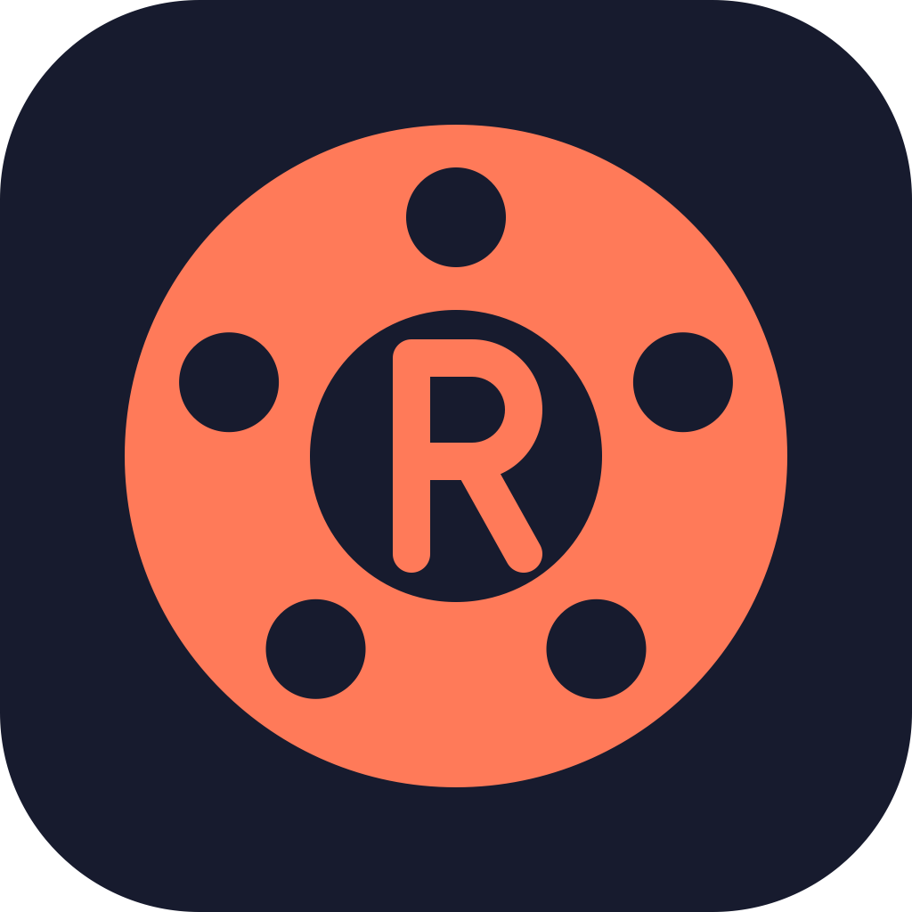

<p align="center"></p>

# Reel

Reel is a private, offline-only macOS screen recorder for a single user. It records the screen, a window or an area with optional camera and microphone, takes screenshots, and opens every recording in a local editor for trimming, captions and export. Nothing leaves the machine: there are no accounts, uploads, share links, update checks, telemetry or crash reporting.

Reel is a modified version of [Cap](https://github.com/CapSoftware/Cap) by Cap Software, Inc., forked from upstream commit `40f44a803` in September 2026 and distributed under the same licence terms (AGPLv3, with the `cap-camera*` and `scap-*` crates under MIT; see `LICENSE`). The web app, cloud features, instant mode and every other server-backed code path have been removed rather than disabled. Reel is not affiliated with or endorsed by Cap Software.

## Build

Requirements: macOS, Bun 1.4.x, Rust 1.88 (pinned by `rust-toolchain.toml`), Node 20.

```bash
bun install --frozen-lockfile
bun run cap-setup
bun run dev:desktop
```

`bun run cap-setup` fetches the native dependencies the desktop crate needs. `bun run dev:desktop` starts the Tauri dev build; macOS grants screen and microphone permission to the terminal that runs it. A release bundle is built with:

```bash
bun run tauri:build
```

The `.app` and a `.dmg` are written under `target/release/bundle/`.

## Layout

- `apps/desktop`: the Tauri v2 app (SolidStart frontend in `src`, Rust in `src-tauri`).
- `apps/cli`: the local CLI, also used as the export sidecar.
- `crates/*`: recording, camera, rendering, editing and export crates.
- `packages/ui-solid`: shared Solid components and icons.

See `AGENTS.md` for coding conventions and the checks to run before committing, and `docs/` for the fork notes and the strip treemap.
